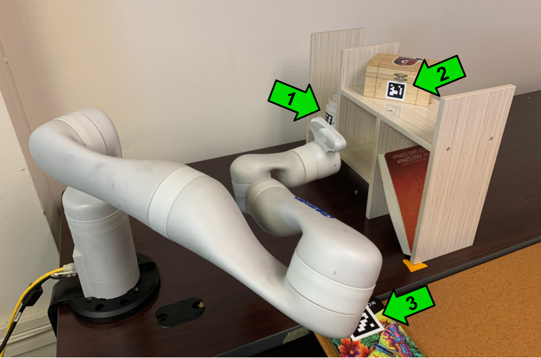

# continuing-laban-motion-dataset

A new dataset collected to detect qualities of expressivity in robotic arm trajectories. This dataset was released as part of an HRI conference paper under review entitled "Replicating Automatic Laban Effort Labeling for Robot Arm Motion in a New Task Context". Please cite this paper to acknowledge use of the dataset. 

This short paper is a replication of a previous RA-L paper entitled "Can We Automatically Label Expressive Robot Arm Motion Qualities? Open Dataset and Machine Learning Results." with a public dataset found [here](https://github.com/shareresearchteam/laban-motion-dataset). The previous paper centered on an inspection of 3 sides of a cube. Our replication paper examines a new task of bookshelf inspection with 3 ArUco tags spread out shown in the figure below.  

<!--  -->

This data was collected with two ideas from the study of human movement in mind: Laban Motion Analysis, and especially the subtopic of Laban Efforts. Within the dataset, files are named by <Participant#_Condition>.csv, with condition labels being one of 8 specific styles based on the Laban Effort Axes: 
Weight axis:
- A --> Strong
- B --> Light
Space axis:
- C --> Direct
- D --> Indirect
Flow axis:
- E --> Free
- F --> Bound
Time axis:
- G --> Sustained
- H --> Sudden

<!-- In the raw data files, the file name ending "_new" indicate motions that were truncated in post-processing steps. -->

## Folder Organization
- **raw_data:** The full raw trajectories of robot motion with measured joint positions, velocities, and efforts in an array. 8 Joint values are listed from the end-effector actuators backward to the first joint.

<!-- - **raw_splits:** The raw trajectories split into 3 segments with each segment  -->

- **processed_data:** Extracted Features From Raw Trajectories 

